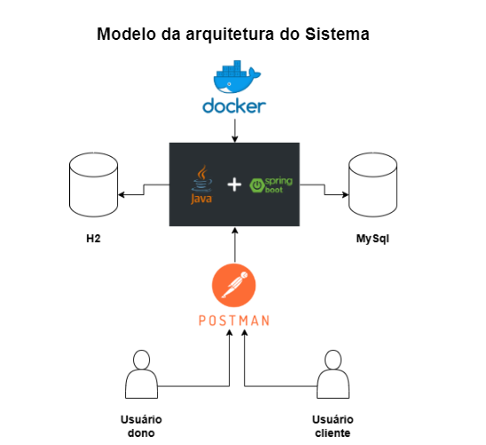

# FiapFood

## 1. Introdução

Um grupo de restaurantes decidiu criar, em conjunto, um sistema de gestão compartilhada para reduzir custos e melhorar a experiência dos clientes, permitindo que escolham restaurantes pela comida e não pelo sistema. O sistema será entregue em fases, possibilitando ajustes contínuos.

A aplicação utiliza Docker para subir o Spring Boot e o banco de dados H2 (em memória) para persistência dos dados.

### Tecnologias Utilizadas




## 2. Endpoints da API

### URL Root

```
http://localhost:8080/fiapfood/
```

### Endpoints

| Endpoint                      | Método | Descrição                                 |
|-------------------------------|--------|-------------------------------------------|
| `/login`                      | POST   | Recebe um JSON com matrícula e senha      |
| `/usuarios`                   | POST   | Cadastrar usuários                        |
| `/usuarios/{{id}}`            | GET    | Buscar usuário por ID                     |
| `/usuarios?pagina={{pagina}}` | GET    | Retorna todos os usuários paginados       |
| `/usuarios/{{id}}/status`     | DELETE | Inativa usuário                           |
| `/usuarios/{{id}}/status`     | PATCH  | Ativa usuário                             |
| `/usuarios/{{id}}/endereco`   | PATCH  | Atualizar endereço                        |
| `/usuarios/{{id}}/perfil`     | PATCH  | Atualizar perfil                          |
| `/usuarios/{{id}}/nome`       | PATCH  | Atualizar nome                            |
| `/usuarios/{{id}}/email`      | PATCH  | Atualizar e-mail                          |
| `/login/{{matricula}}/senha`  | PATCH  | Atualizar senha                           |

## 3. Configuração do Projeto

### Docker Compose

### Executando o docker-compose localmente

Para executar o `docker-compose.yml` localmente, siga os passos abaixo no terminal:

1. Certifique-se de estar no diretório do projeto.
2. Execute o comando:

   ```sh
   docker-compose up --build
   ```

Isso irá construir a imagem e iniciar o container.  
A aplicação ficará disponível em: [http://localhost:8080/fiapfood/](http://localhost:8080/fiapfood/)  
O banco de dados H2 estará acessível em: [http://localhost:8080/fiapfood/h2-console](http://localhost:8080/fiapfood/h2-console)

#### Credenciais do banco de dados

- **JDBC URL:** `jdbc:h2:mem:fiapfood`
- **Username:** `admin`
- **Password:** `fiapfood`

## 4. Collections para Teste

- **Collection do Postman:**  
  [Acesse aqui](https://www.postman.com/dark-moon-236306/workspace/fiap-team-35/collection/1827882-9e3d0982-3f83-4d80-aeec-73c78a77199b?action=share&creator=1827882)

